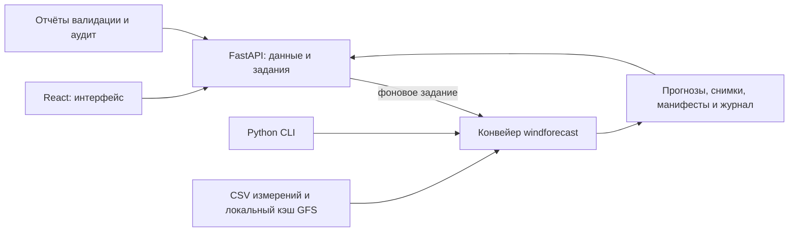

# WindPulse AI — прогноз выработки ветропарка

**Проект HackAlem AI · команда «Мы сюда случайно»**

Изменчивость ветра и пропуски измерений усложняют планирование выработки. WindPulse AI строит почасовой прогноз для двух ветровых турбин и показывает его вместе с погодой, свежестью измерений и происхождением расчёта. Решение предназначено для операторов и аналитиков ветропарка: оно помогает оценивать ожидаемое изменение выработки и видеть, на каких данных основан прогноз.

Текущая версия — воспроизводимый исторический прототип с русскоязычным веб-интерфейсом и Python CLI. В интерфейсе доступны горизонты **24 и 48 часов**, в CLI — от 1 до 48 часов.

> Результат — **безразмерная нормализованная мощность и общий индекс 0–1**, не МВт или МВт·ч. Фактические измерения заканчиваются 31 января 2026 года. **Фактические измерения за февраль 2026 года не предоставлены. Точность февральского прогноза пока не рассчитана.**

[Установка и запуск](#установка-и-запуск) · [Сценарий для жюри](#как-проверить-решение) · [Подтверждённые результаты](reports/results.md) · [Комплект данных для передачи](docs/handoff.md)

## Что реализовано

| Компонент | Возможности |
|---|---|
| **Обзор** | Выбор исторического момента выпуска, 24/48 часов, средний и максимальный индекс, изменение между половинами горизонта, возраст измерений |
| **Графики** | Общий индекс и линии двух турбин, точные подсказки, масштабирование, доступная фактическая история до выпуска, мини-графики турбин |
| **История прогнозов** | Реальные сохранённые выпуски, фильтры по дате и модели, открытие результата и скачивание исходного CSV |
| **Качество модели** | MAE, RMSE и смещение, выбор турбины/индекса и горизонта, исторический график «прогноз — факт», отдельная контрольная проверка |
| **Данные и допущения** | Период измерений, пропуски, правила агрегации, ограничения погоды и вопросы организаторам |
| **Фоновый расчёт** | Новое задание из локального кэша, реальные состояния шести этапов, понятные ошибки, защита от конфликтующих одновременных веб-заданий |
| **Python CLI** | Аудит, прогноз, загрузка новых измерений, временная валидация, последовательное воспроизведение исторических выпусков и наблюдение за изменениями |
| **Воспроизводимость** | Снимки входных данных, параметры модели, контрольные суммы, версии библиотек, журнал событий и повторное обучение из сохранённого снимка |

Просмотр сохранённых результатов не запускает обучение. Новые веб-расчёты сохраняются отдельно в `artifacts/web_forecasts/runs/`. Повтор при идентичных входах может переиспользовать существующий результат. Интерфейс адаптирован для компьютера, планшета и телефона, поддерживает клавиатуру и уменьшенную анимацию.

## Как работает решение

1. **Измерения → часовые цели.** Проект читает два CSV, проверяет временные метки и значения. Среднее за час рассчитывается при наличии минимум 5 из 6 валидных десятиминутных измерений. Турбины объединяются по времени; пропуски не заменяются нулями.
2. **Момент выпуска → доступные входы.** Пользователь выбирает историческую дату. Для расчёта берутся только завершённые и доступные к этому моменту измерения и допустимый архивный погодный выпуск.
3. **Погода и история → признаки.** Используются лаги мощности, календарные признаки и, для погодной модели, прогнозные ветер и температура NOAA GFS. Будущие фактические значения не подставляются.
4. **Модель → прогноз.** Конвейер рассчитывает обе турбины и равновесный индекс `farm_proxy = (turbine_1 + turbine_2) / 2`. Режим `auto` использует совместимый сохранённый выбор модели только после доступности его оценочных целей; иначе выбирает базовую модель с указанием причины.
5. **Проверки → сохранение.** Проверяются часы, конечность чисел, диапазон, согласованность индекса и доступность погоды. Затем сохраняются CSV, снимки входов и манифест. Ошибка останавливает задание и отображается в интерфейсе.
6. **Результат → просмотр.** Пользователь изучает график, погоду, возраст входов и журнал либо скачивает CSV. Для сохранённого выпуска показываются подтверждённые этапы, без имитации нового расчёта.

Agentic AI в этом проекте реализован как **детерминированный оркестратор**: он управляет этапами, проверяет условия, повторяет временные сетевые ошибки при явно разрешённой загрузке и пересчитывает результат при изменении входов. **LLM и внешние генеративные AI API не используются.** Числовой прогноз строят модели машинного обучения и базовая модель.

По принятому правилу ежедневный выпуск создаётся на **23:00 UTC+05:00**, целевые часы начинаются через 1…48 часов. Например, выпуск 31 января покрывает 1–2 февраля; выпуск 28 февраля включает 1–2 марта. Момент выпуска отличается от времени целевого часа и фактического времени создания файла.

## Технологии

| Область | Реализация в репозитории |
|---|---|
| Обработка данных | Python, pandas, NumPy |
| Модели | scikit-learn: `ExtraTreesRegressor`, фиксированный seed; `persistence` — последнее доступное часовое среднее |
| Варианты прогноза | `persistence`, `extra_trees` без погоды, `extra_trees_weather` с архивными прогнозами погоды |
| API и задания | FastAPI, Pydantic, Uvicorn; отдельный Python-процесс для длительного расчёта |
| Веб-интерфейс | TypeScript, React 19, Vite 7, Tailwind CSS 4, Recharts 3, Lucide React |
| Погода | Операционный архив NOAA GFS на публичном Amazon S3, HTTP через `requests`, GRIB2 через ecCodes |
| Хранение | Локальные CSV, JSON, JSONL, погодные файлы и снимки моделей; отдельная база данных не требуется |
| Проверки | pytest, HTTP-проверки API с httpx, TypeScript и производственная сборка Vite |

Точные зависимости: [pyproject.toml](pyproject.toml), [requirements.lock](requirements.lock), [requirements-web.lock](requirements-web.lock), [web/package.json](web/package.json), [web/pnpm-lock.yaml](web/pnpm-lock.yaml).

## Архитектура проекта



```text
web/                         интерфейс, графики, стили и сборка Vite
windpulse_api/                API чтения результатов и управление заданиями
windforecast/
  cli.py                     команды проекта
  data.py                    чтение, аудит, агрегация и новые партии измерений
  weather.py                 выбор архивов NOAA GFS, GRIB и кэш
  models.py                  признаки и модели
  pipeline.py                цикл расчёта, проверки и сохранение
  evaluation.py              временная валидация и выбор модели
  verification.py            воспроизведение расчёта из снимка
config.example.json          пути, координаты, время и параметры расчёта
reports/                     аудит, метрики и компактные результаты
docs/                        методика, ограничения и правила передачи
scripts/                     сводные отчёты и проверки воспроизводимости
tests/                       проверки данных, погоды, конвейера, CLI и API
data/                        локальные измерения и погода, исключены из Git
artifacts/                   локальные результаты и задания, исключены из Git
```

Фронтенд не обучает модель и не дублирует расчёт признаков. API читает сохранённые файлы, а при запуске задания вызывает существующий Python-конвейер. `forecast.csv` содержит момент выпуска, целевой час, горизонт, прогнозы турбин, индекс и сведения о модели/погоде. `manifest.json` связывает результат с входами, конфигурацией, версиями и проверками.

## Установка и запуск

### 1. Подготовить окружение

Команды ниже выполняются **из корня полной рабочей копии проекта** и приведены для PowerShell на Windows.

- **Python 3.12+** для зафиксированных зависимостей; проверенное окружение — **Python 3.12.14**.
- **Node.js 24.19.0 и pnpm 11.19.0** — проверенное окружение фронтенда.
- Для демонстрации просмотра нужны сохранённые результаты; для нового расчёта — исходные CSV и погодный кэш из следующего шага.

```powershell
python -m venv .venv
.venv\Scripts\python -m pip install -r requirements-web.lock
.venv\Scripts\python -m pip install --no-deps -e .
pnpm --dir web install --frozen-lockfile
pnpm --dir web build
```

`requirements-web.lock` включает основные зависимости модели из `requirements.lock`. Если в окружении нет `pip`, установленный `uv` позволяет выполнить те же шаги установки Python-пакетов:

```powershell
uv pip install --python .venv\Scripts\python.exe -r requirements-web.lock
uv pip install --python .venv\Scripts\python.exe --no-deps -e .
```

На Linux/macOS путь `.venv\Scripts\python` заменяется на `.venv/bin/python`. Установка зависимостей может потребовать сеть. Ключи API и секреты не нужны. Поддержка Python 3.11 указана в `pyproject.toml`, но зафиксированный комплект NumPy/SciPy требует Python ≥3.12; для проверки переданных снимков используйте проверенное окружение.

### 2. Подготовить данные

**Для просмотра готовой демонстрации** разместите переданные полные каталоги запусков `artifacts/` и отчёты `reports/` в корне проекта с сохранением структуры. Для нового расчёта добавьте `data/` с исходными CSV и погодным кэшем. Состав, размеры и контрольные суммы приведены в [манифесте передачи](docs/handoff.md). Для исходников веб-версии также нужны `web/`, `windpulse_api/`, `requirements-web.lock` и `docs/`.

**Если получены только два оригинальных CSV**, импортируйте их, подставив свои реальные пути вместо примера `C:\datasets\...`:

```powershell
.venv\Scripts\python -m windforecast init-data --turbine-1 "C:\datasets\turbine_1.csv" --turbine-2 "C:\datasets\turbine_2.csv"
.venv\Scripts\python -m windforecast audit
```

`init-data` копирует файлы в `data/raw/`, сохраняет оригиналы и отказывается перезаписывать другое содержимое. `audit` пересоздаёт локальный отчёт качества. Источником по умолчанию служит [config.example.json](config.example.json); для своей конфигурации используйте `--config config.local.json` **перед подкомандой** CLI. Относительные пути считаются от каталога конфигурации. Описанный веб-сценарий использует поставляемый фиксированный UTC+05:00.

**Если погодного кэша нет**, его загрузка запускается только явной командой. Для существующей валидации и февральского сценария нужна также декабрьская/январская история обучения:

```powershell
# Сетевая операция: выполняется заранее, а не во время короткой демонстрации.
.venv\Scripts\python -m windforecast cache-weather --start 2025-12-08 --end 2026-02-28 --horizon 48
```

Имеющийся погодный комплект занимает около **371 MiB**. Восстановление зависит от доступности NOAA; получение прежних метаданных архива не гарантируется. Подробнее — [источник погоды](docs/weather-source.md). Без `data/` и `artifacts/` интерфейс запускается с пустой историей и объясняет недоступность расчёта. Таблицы в `reports/` сами по себе не заменяют снимки запусков.

### 3. Запустить приложение

```powershell
.venv\Scripts\python -m windpulse_api --host 127.0.0.1 --port 8000
```

Откройте **[WindPulse AI — http://127.0.0.1:8000](http://127.0.0.1:8000)**. Один сервер обслуживает собранный интерфейс и API. Терминал должен оставаться запущенным; остановка — `Ctrl+C`. Если менялся код интерфейса, повторите `pnpm --dir web build` и обновите страницу.

Для разработки оставьте API на порту 8000 и во втором терминале выполните `pnpm --dir web dev`. Интерфейс будет доступен на [http://127.0.0.1:5173](http://127.0.0.1:5173), запросы API перенаправляются к порту 8000.

Веб-приложение **не скачивает погоду автоматически**: расчёт работает только с локальным кэшем. Наличие части кэша не гарантирует доступность каждой выбранной даты и всех обучающих выпусков.

## Как проверить решение

### Сценарий для жюри на 3–5 минут

Перед показом установите зависимости и подготовьте комплект данных. Для просмотра не нужно заново обучать модели.

1. Откройте приложение и сохранённый выпуск **31.01.2026, 23:00 UTC+05:00**, горизонт **48 часов**. Для исходного конкурсного результата средний индекс равен **0,459**, максимальный — **0,730** с округлением до трёх знаков.
2. Переключите горизонт на 24 часа, линии турбин, историю фактов и масштаб графика. Откройте подсказку и скачайте CSV. На 24-часовом представлении сохранённого 48-часового выпуска показываются первые 24 точки, а CSV содержит полный исходный горизонт, указанный на кнопке.
3. Раскройте «Сведения о расчёте»: покажите модель, источники, проверки и журнал. В погодной карточке указаны архив NOAA GFS, время его выпуска, высота ветра и сетка.
4. В «Истории прогнозов» выберите конкурсные выпуски и откройте **28.02.2026**. Возраст измерений составляет **671 час**; отсутствующие февральские факты не нарисованы.
5. В «Качестве модели» сравните модели, затем отдельно выберите контрольную проверку. Переключите турбину и горизонты 1–24 / 25–48. График относится к одному историческому выпуску, без объединения перекрывающихся прогнозов.
6. Вернитесь к 31 января, выберите 24 часа и нажмите «Пересчитать». Задание выполняется в фоне, результат открывается после завершения. Повтор с теми же входами может переиспользовать уже рассчитанный результат. Отдельный расчёт на 24 часа может отличаться от первых 24 часов модели, обученной для 48 часов.

Чистый исходный комплект без готовых запусков можно проверить через CLI. После импорта CSV выполните базовый прогноз без погоды:

```powershell
.venv\Scripts\python -m windforecast forecast --issue "2026-01-31T23:00:00+05:00" --horizon 48 --model persistence --weather off
```

CLI напечатает каталог с `forecast.csv` и `manifest.json`; после обновления страницы результат появится в истории. Это проверка работоспособности базового режима, **не погодный конкурсный прогноз**. Для модели с погодой при готовом кэше:

```powershell
.venv\Scripts\python -m windforecast forecast --issue "2026-01-31T23:00:00+05:00" --horizon 48 --model extra_trees_weather --weather cache
```

### Автоматические проверки и воспроизводимость

```powershell
.venv\Scripts\python -m pytest -q
pnpm --dir web build

# Для переданного исходного снимка первого конкурсного выпуска:
.venv\Scripts\python -m windforecast verify-run artifacts/runs/a587f5347a6fc4512eec87fc
```

Тесты работают с изолированными временными данными. `verify-run` проверяет контрольные суммы и повторно обучает модель по сохранённым снимкам без сети; требует совпадения кода и версий библиотек, допуск сравнения — `1e-12`. Если снимок не передан, укажите реально существующий каталог, напечатанный CLI. На другом пути проекта ID нового результата может отличаться.

В [протоколе проверки веб-версии от 23.09.2026](docs/windpulse-acceptance.md) зафиксированы **55 тестов и 9 подпроверок**, успешная сборка, **596 сверок API**, реальные задания и браузерная проверка компьютера/планшета/телефона. Это результаты указанной проверки; на новом компьютере команды нужно выполнить заново. Подробные команды валидации, replay, загрузки новых измерений и непрерывного цикла — в [технической инструкции](docs/technical-guide.md).

### Подтверждённые исторические результаты

MAE общего индекса за горизонт 1–48 часов, в единицах шкалы 0–1:

| Выборка | Persistence | ExtraTrees | ExtraTrees + погода |
|---|---:|---:|---:|
| 7 выпусков 22–28.01.2026, выбор модели | 0,424923 | 0,325312 | **0,267529** |
| 1 выпуск 29.01.2026, контроль | 0,381719 | 0,336710 | **0,307882** |

Источник: [сохранённые метрики и методика оценки](reports/results.md). Для отделения выбора от контрольного выпуска использован дополнительный выбор по **22–26 января** без общих целевых часов с контролем. Разделение ретроспективное, контроль — один выпуск; полные семь выпусков выбора частично пересекаются с контролем. Эти числа не являются февральской точностью или доказательством качества на новых сезонах.

Сохранённый исторический replay содержит **29 выпусков × 48 часов = 1 392 строки**, покрывающие **720 уникальных целевых часов**. Горизонты перекрываются, последние включают начало марта. Полные результаты: [february_replay.csv](reports/february_replay.csv), [replay_summary.json](reports/replay_summary.json).

## Данные и интеграции

### Измерения турбин

Источник — два предоставленных организаторами CSV с десятиминутными измерениями. Их фактический период: **11.03.2023 00:00 — 31.01.2026 23:50** по записанному времени. Дата `28.02.2026` в названии файлов не подтверждается содержимым.

| Показатель | Турбина 1 | Турбина 2 |
|---|---:|---:|
| Записи | 142 360 | 149 499 |
| Пропущенные десятиминутные слоты | 9 992 | 2 853 |
| Валидные часовые цели при покрытии ≥5/6 | 23 706 | 24 870 |
| Координаты, широта / долгота | 43.645150 / 78.535604 | 43.643198 / 78.538828 |

Аудит и правила: [data_audit.json](reports/data_audit.json), [data-findings.md](docs/data-findings.md). Исходные CSV не скачиваются автоматически и должны быть переданы отдельно. Новые партии можно добавлять командой `ingest`; сохраняются время получения и контрольная сумма, исходники не переписываются. Готового подключения к SCADA нет.

### Архивная погода

Используется **NOAA GFS** — отдельные операционные выпуски из публичного S3-архива, с проверкой времени и контрольных сумм. В поставляемой конфигурации: сетка **1°**, ветер **10 м**, температура **2 м**. Трёхчасовые прогнозные значения интерполируются внутри одного погодного выпуска; фактическая выработка не интерполируется.

Обеим турбинам соответствует ближайший узел **44°N, 79°E**, примерно в **54 км**. Локальный кэш описанного комплекта содержит **83 ежедневных погодных цикла** за 08.12.2025–28.02.2026. Погода на экране — архивный прогноз, не текущие наблюдения. Доказательства выбора источника и проверки доступности — в [weather-source.md](docs/weather-source.md).

Просмотр локальных результатов не требует внешнего API. Сеть нужна для установки пакетов и явно запрошенного пополнения погодного архива. Внешних AI API, облачной базы данных и сервиса авторизации в текущем решении нет.

## Ограничения

- **Нет февральских фактов.** Измерить качество конкурсного периода пока нельзя. Историческая валидация получает новые измерения каждый день и не проверяет месяц работы без обновления мощности.
- **Нормализация и мощности не уточнены.** Общий индекс — среднее двух нормализованных рядов, а не физическая суммарная мощность или доказанная доля номинала.
- **Время — проектное допущение.** Приняты фиксированный UTC+05:00, начало десятиминутного интервала и ежедневный выпуск в 23:00. Оригинальных журналов доставки измерений нет; правила требуют подтверждения организаторов.
- **Грубая погодная сетка.** Узел примерно в 54 км и ветер на 10 м не описывают локальный рельеф и ветер на высоте ступицы. Проверенные результаты для более мелкой сетки не заявляются.
- **Историческая доступность ограниченно подтверждена.** Время выпуска, запас публикации и `Last-Modified` проверяются, но не заменяют полный журнал первоначальной публикации и получения прогноза командой.
- **Короткая контрольная оценка.** Один 48-часовой выпуск и ретроспективное разделение не подтверждают качество для будущих сезонов. Интервалы неопределённости не рассчитаны.
- **Локальный прототип.** Нет производственного подключения к оборудованию, управления турбинами, авторизации, облачного размещения и промышленного мониторинга. Веб-задания требуют локальных файлов и полного кэша выбранных выпусков.
- **Код не заменяет комплект данных.** `data/`, `artifacts/`, `.venv/`, `node_modules/` и `web/dist/` исключены из Git; зависимости и интерфейс собираются на принимающем компьютере, данные передаются отдельно.

Следующие шаги: уточнить время и номиналы у организаторов, получить февральские измерения, расширить сезонную оценку, проверить более детальную погоду и рассчитать интервалы неопределённости. Полный список вопросов сохранён в [технической инструкции](docs/technical-guide.md#открытые-вопросы-организаторам).

## Развёрнутая версия

**Публичная deployed-версия в репозитории не указана.** Доступен локальный запуск по адресу [http://127.0.0.1:8000](http://127.0.0.1:8000) после выполнения инструкции выше. Этот адрес работает на компьютере, где запущен сервер, и не является публичной ссылкой для жюри.

Для передачи решения используйте [манифест комплекта](docs/handoff.md), [техническую инструкцию](docs/technical-guide.md), [отчёт о результатах](reports/results.md) и [протокол проверки интерфейса](docs/windpulse-acceptance.md).
